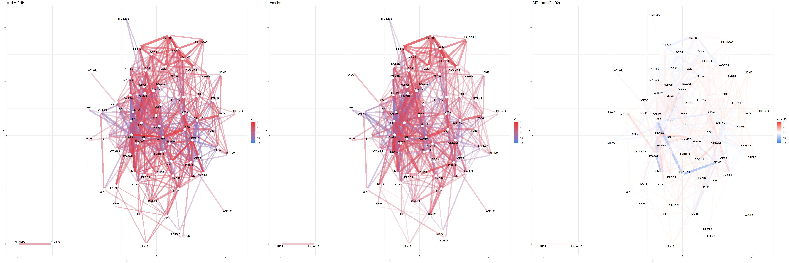
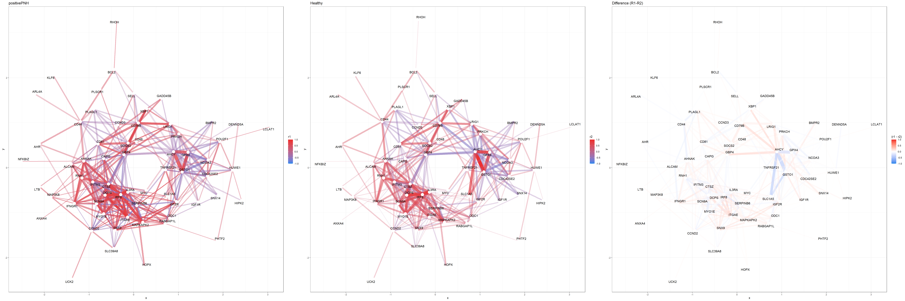
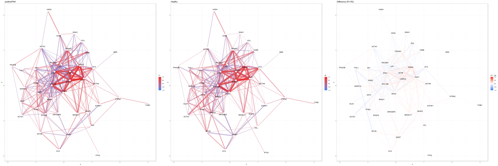

# GSNCASCR
Gene Sets Net Correlations Analysis with Single Cell RNA-seq

GSNCASCR is a R package for pathway level co-expression analysis from single cell RNA-sequencing data. It intergates the advantages of GCNCA and CS-CORE.

  

HALLMARK INTERFERON GAMMA RESPONSE positivePNH and Healthy Donor

  

HALLMARK IL2 STAT5 SIGNALING positivePNH Healthy Donors

  

HALLMARK APICAL JUNCTION positivePNH and Healthy Donor

We use the single cell RNA-sequencing data on PBMC from COVID patients and healthy controls from Nature Medicine volume 26, pages1070–1076 (2020). The data is available at https://hosted-matrices-prod.s3-us-west-2.amazonaws.com/Single_cell_atlas_of_peripheral_immune_response_to_SARS_CoV_2_infection-25/blish_covid.seu.rds

Code to prepare sample code

pbmc <- readRDS('../blish_covid.seu.rds')

DefaultAssay(pbmc) <- 'RNA'

pbmc_B = pbmc[,pbmc$cell.type.coarse %in% 'B']

mean_exp = rowMeans(pbmc_B@assays$RNA@counts/pbmc_B$nCount_RNA)

genes_selected = names(sort.int(mean_exp, decreasing = T))[1:5000]

save(pbmc_B, genes_selected, file = "pbmc_B.RData")
